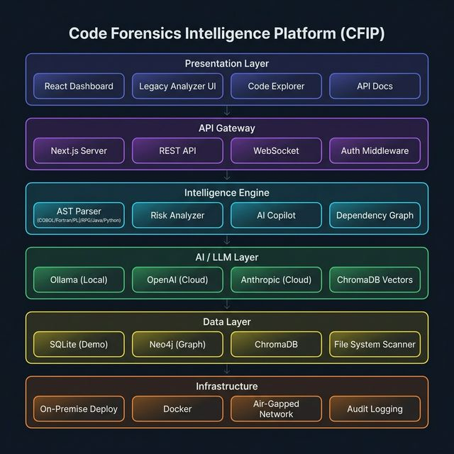

# CFIP — Code Forensics Intelligence Platform

> **AI-Powered Code Intelligence for BFSI Legacy Modernization**



CFIP is an enterprise-grade platform that analyzes, comprehends, and modernizes complex codebases — with first-class support for **COBOL**, **Fortran**, **PL/I**, **RPG** and other legacy languages alongside modern stacks (Java, Python, TypeScript, Go, Kotlin).

Designed for **on-premise, air-gapped BFSI environments**, CFIP runs entirely locally with zero data exfiltration.

---

## Core Capabilities

| Capability | Description |
|---|---|
| **Legacy Language Analyzer** | Auto-detect COBOL/Fortran/PL/I/RPG, extract PROGRAM-ID, SECTION, PARAGRAPH, PERFORM, CALL, COPY structures |
| **Code Comprehension** | AST-based parsing, dependency graph generation, complexity scoring |
| **Architecture Reconstruction** | 6-layer architecture visualization, module-to-business mapping |
| **Risk & Impact Analysis** | GO TO spaghetti detection, copybook sprawl, Y2K-era dates, missing error handling |
| **AI-Powered Remediation** | Local LLM (Ollama gemma3) generates modernization recommendations |
| **Dependency Visualization** | Interactive knowledge graph (Neo4j-backed) with criticality scoring |
| **AI Copilot** | Chat with your codebase securely via ChromaDB + gemma3 |
| **Governance Dashboard** | Compliance tracking, SLA monitoring, audit logging |
| **Product Tour** | Interactive guided walkthrough of all platform features |

---

## System Architecture

```
┌─────────────────────────────────────────────────────────┐
│  Presentation Layer       React Dashboard │ Legacy       │
│                           Analyzer UI     │ Code Explorer│
├─────────────────────────────────────────────────────────┤
│  API Gateway              Next.js Server │ REST API      │
├─────────────────────────────────────────────────────────┤
│  Intelligence Engine      AST Parser (COBOL/Fortran/    │
│                           PL/I/RPG/Java/Python)          │
│                           Risk Analyzer │ AI Copilot     │
├─────────────────────────────────────────────────────────┤
│  AI / LLM Layer           Ollama (Local) │ ChromaDB      │
│                           OpenAI │ Anthropic (Optional)  │
├─────────────────────────────────────────────────────────┤
│  Data Layer               SQLite │ Neo4j │ ChromaDB      │
├─────────────────────────────────────────────────────────┤
│  Infrastructure           On-Premise │ Docker │ Air-Gap  │
└─────────────────────────────────────────────────────────┘
```

---

## Supported Languages

| Language | Extensions | Parser |
|---|---|---|
| **COBOL** | `.cob`, `.cbl`, `.cpy` | Regex: PROGRAM-ID, SECTION, PARAGRAPH, PERFORM, CALL, COPY |
| **Fortran** | `.f`, `.f90`, `.f95`, `.f03`, `.for` | Regex: PROGRAM, SUBROUTINE, FUNCTION, MODULE, CALL, USE |
| **PL/I** | `.pli`, `.pl1` | Generic + comment detection |
| **RPG** | `.rpg`, `.rpgle`, `.sqlrpgle` | Generic + comment detection |
| **Java** | `.java` | Regex: class, method, import extraction |
| **Python** | `.py` | Full AST parsing |
| **JavaScript/TypeScript** | `.js`, `.jsx`, `.ts`, `.tsx` | Regex: function, class, import extraction |
| Go, Kotlin, C#, SQL, Ruby, Rust, C/C++ | Various | Extension-based classification |

---

## Quick Start

### Prerequisites
- Node.js 18+
- Python 3.10+ (for engine)
- Ollama (optional, for local AI)

### 1. Install & Run

```bash
# Clone
git clone https://github.com/your-org/cfip.git
cd cfip

# Install dependencies
npm install

# Start development server
npm run dev

# (Optional) Start the analysis engine
cd engine && pip install -r requirements.txt && python main.py
```

### 2. Login

Navigate to `http://localhost:3000/login`

| Email | Password |
|---|---|
| `admin@cfip.io` | `admin123` |

### 3. Explore

- **Dashboard** — Overview with risk heatmap and language breakdown
- **Legacy Analyzer** — Paste COBOL/Fortran code for instant analysis
- **Code Explorer** — Browse file trees and view parsed structures
- **Dependencies** — Interactive knowledge graph
- **Risk & Impact** — Change impact simulation
- **AI Copilot** — Chat with your codebase

---

## Project Structure

```
cfip/
├── src/
│   ├── app/
│   │   ├── page.tsx                  # Landing page
│   │   ├── login/page.tsx            # Authentication
│   │   └── dashboard/
│   │       ├── layout.tsx            # Dashboard shell + sidebar
│   │       ├── page.tsx              # Main dashboard
│   │       ├── legacy/page.tsx       # Legacy Language Analyzer (NEW)
│   │       ├── explorer/page.tsx     # Code Explorer
│   │       ├── dependencies/page.tsx # Dependency Graph
│   │       ├── risk/page.tsx         # Risk & Impact
│   │       ├── engineering/page.tsx  # Engineering Insights
│   │       ├── remediation/page.tsx  # AI Remediation
│   │       ├── architecture/page.tsx # Architecture View
│   │       ├── copilot/page.tsx      # AI Copilot
│   │       ├── governance/page.tsx   # Governance
│   │       ├── business/page.tsx     # Business Intelligence
│   │       └── settings/page.tsx     # Settings
│   ├── components/
│   │   └── ProductTour.tsx           # Interactive product tour
│   └── lib/
│       ├── seed-data.ts              # Demo data (incl. COBOL repos)
│       ├── scan-context.tsx          # Scan state management
│       └── auth.ts                   # Authentication
├── engine/
│   └── services/
│       ├── ast_parser.py             # COBOL, Fortran, Python, Java, JS/TS parsers
│       └── code_scanner.py           # File scanner + language detection
├── public/
│   └── architecture-diagram.png      # System architecture diagram
├── HOW_TO_USE.md                     # User guide
├── DEMO_GUIDE.md                     # Demo walkthrough
└── README.md                         # This file
```

---

## Tech Stack

| Layer | Technology |
|---|---|
| Frontend | Next.js 16, React 19, TypeScript |
| Styling | Vanilla CSS with design tokens |
| Backend | Python FastAPI |
| Database | SQLite (demo), Neo4j (production), ChromaDB (vectors) |
| LLM | Ollama (gemma3:latest, bge-m3:latest) — local by default |
| Visualization | D3.js, react-force-graph |
| Product Tour | react-joyride |
| Deployment | Docker, on-premise, air-gapped |

---

## Security

- ✅ **Zero data exfiltration** — all analysis runs locally
- ✅ **Air-gapped network** — no internet dependency for core features
- ✅ **Role-based access** — admin, analyst, viewer roles
- ✅ **Audit logging** — full action history
- ✅ **Local LLM** — no code sent to external APIs (default)

---

## License

Proprietary — Enterprise License. Contact sales@cfip.io for details.
