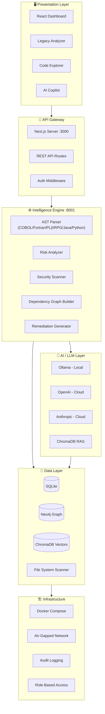
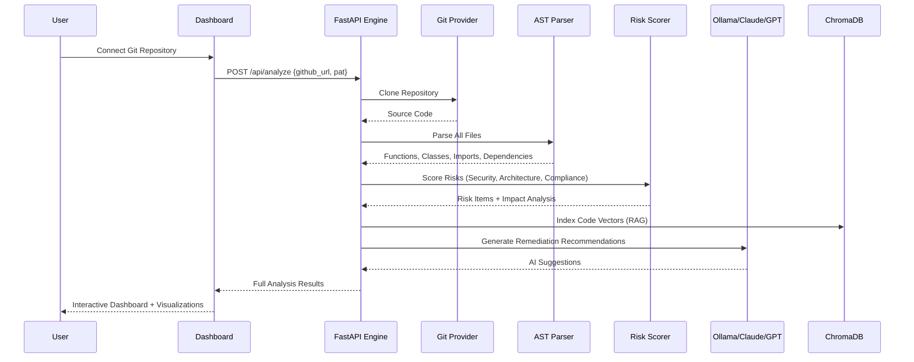
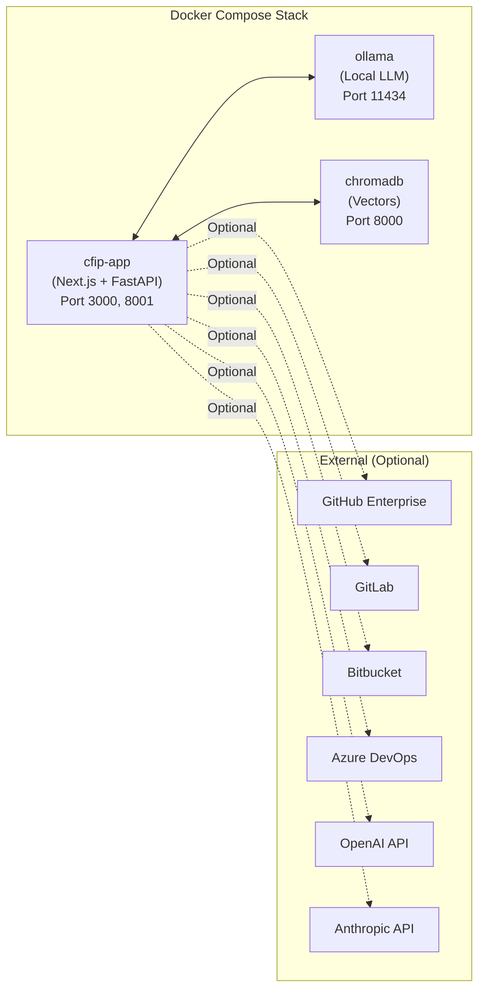

<p align="center">
  <h1 align="center">🔬 CFIP — Code Forensics Intelligence Platform</h1>
  <p align="center">
    <strong>Enterprise-grade AI-powered code intelligence for legacy modernization & security analysis</strong>
  </p>
  <p align="center">
    
    
    
    
    
    
  </p>
</p>

---

## What is CFIP?

CFIP analyzes, comprehends, and modernizes complex codebases — with first-class support for **COBOL, Fortran, PL/I, RPG** alongside modern stacks. Built for **on-premise, air-gapped BFSI environments** with zero data exfiltration.

**One command to deploy. Connect any Git. Analyze everything.**

```bash
docker compose up -d
# Open http://localhost:3000
```

---

## System Architecture



## Data Flow — Code Analysis Pipeline



## Deployment Architecture



---

## Core Capabilities

| Capability | Description |
|---|---|
| 🔍 **Legacy Language Analyzer** | Auto-detect COBOL/Fortran/PL/I/RPG, extract structures, identify anti-patterns |
| 🧠 **AI Code Comprehension** | AST-based parsing with dependency graph and complexity scoring |
| 🏗️ **Architecture Reconstruction** | 6-layer visualization, module-to-business capability mapping |
| ⚠️ **Risk & Impact Analysis** | Change impact simulation, blast radius prediction, SLA risk |
| 🔒 **Security Analysis** | OWASP Top 10 detection, hardcoded secrets, SQL injection patterns |
| 🤖 **AI Copilot** | Chat with your codebase via local Ollama (or cloud GPT-4/Claude) |
| 🛠️ **AI Remediation** | Auto-generated refactoring patches with confidence scoring |
| 📊 **Governance Dashboard** | Compliance tracking, audit logging, change workflows |
| 🚀 **Product Tour** | Interactive guided walkthrough of all features |

---

## Quick Start

### Prerequisites

| Requirement | Version | Required |
|---|---|---|
| Docker + Docker Compose | 24+ | ✅ Yes |
| Node.js (dev only) | 18+ | For local dev |
| Python (dev only) | 3.10+ | For engine dev |
| Ollama | Latest | For local AI |
| Git | 2.0+ | ✅ Yes |

### Option 1: Docker (Recommended — One Command)

```bash
# Clone
git clone https://github.com/jai2033shankar/cfip.git
cd cfip

# Deploy entire stack
docker compose up -d

# Open browser
open http://localhost:3000
```

This starts:
- **CFIP App** (Next.js + FastAPI) on `http://localhost:3000`
- **Ollama** (Local LLM) on `http://localhost:11434`
- **ChromaDB** (Vector Store) on `http://localhost:8000`

### Option 2: Local Development

```bash
# Frontend
npm install --legacy-peer-deps
npm run dev

# Engine (separate terminal)
cd engine
pip install -r requirements.txt
python main.py

# Ollama (separate terminal)
ollama serve
ollama pull gemma3:latest
ollama pull bge-m3:latest
```

### Login

| Email | Password | Role |
|---|---|---|
| `admin@cfip.io` | `admin123` | Administrator |

---

## Enterprise Git Integration

CFIP connects to any Git provider — no vendor lock-in:

| Provider | Auth Method | Status |
|---|---|---|
| GitHub / GitHub Enterprise | PAT, SSH | ✅ Supported |
| GitLab (Self-Hosted) | PAT, SSH | ✅ Supported |
| Bitbucket Server | PAT | ✅ Supported |
| Azure DevOps | PAT | ✅ Supported |

Configure in **Settings → Git Integration** or via environment variables:

```env
GIT_PROVIDER=github
GIT_BASE_URL=https://github.example.com/api/v3
GIT_PAT=ghp_xxxxxxxxxxxx
```

---

## LLM Support — No Token Limitations

| Provider | Model | Deployment | Token Handling |
|---|---|---|---|
| **Ollama** (default) | gemma3:latest | Local, air-gapped | Unlimited — local inference |
| **OpenAI** | GPT-4o | Cloud API | Streaming + chunked context |
| **Anthropic** | Claude 3.5 Sonnet | Cloud API | Streaming + chunked context |

All LLM calls use **streaming responses** — no request timeouts or token truncation. Code context is chunked and indexed via ChromaDB RAG for unlimited repository sizes.

---

## Supported Languages

| Language | Extensions | Parser Type | Anti-Pattern Detection |
|---|---|---|---|
| **COBOL** | `.cob .cbl .cpy` | Regex (PROGRAM-ID, SECTION, PERFORM, CALL, COPY) | GO TO, Y2K dates, missing STOP RUN |
| **Fortran** | `.f .f90 .f95 .for` | Regex (PROGRAM, SUBROUTINE, FUNCTION, MODULE) | — |
| **PL/I** | `.pli .pl1` | Generic + comment detection | — |
| **RPG** | `.rpg .rpgle` | Generic + comment detection | — |
| **Java** | `.java` | Regex (class, method, import) | Long methods, deep nesting |
| **Python** | `.py` | Full AST | Circular imports, complexity |
| **JS/TS** | `.js .jsx .ts .tsx` | Regex (function, class, import) | Callback hell, large files |
| C#, Go, Kotlin, SQL, Ruby, Rust, C/C++ | Various | Extension-based | Basic patterns |

---

## Security Posture

```
✅ Zero data exfiltration — all analysis runs locally
✅ Air-gapped compatible — no internet required for core features  
✅ On-premise first — Docker + bare metal supported
✅ Role-based access control — admin, analyst, viewer
✅ Audit logging — full action history with timestamps
✅ Local LLM — no code sent to external APIs (default)
✅ Secrets detection — scans for leaked API keys, passwords, tokens
✅ OWASP-aware — SQL injection, XSS, and hardcoded credential detection
✅ Encrypted at rest — configurable volume encryption
✅ No telemetry — zero phone-home, zero tracking
```

---

## Project Structure

```
cfip/
├── Dockerfile                    # Multi-stage build (Node.js + Python)
├── docker-compose.yml            # Full stack: app + Ollama + ChromaDB
├── docker-entrypoint.sh          # Startup orchestrator
├── .env.example                  # Configuration template
├── src/
│   ├── app/
│   │   ├── page.tsx              # Landing page
│   │   ├── login/page.tsx        # Authentication
│   │   └── dashboard/
│   │       ├── layout.tsx        # Dashboard shell + sidebar
│   │       ├── page.tsx          # Main dashboard
│   │       ├── legacy/page.tsx   # Legacy Language Analyzer
│   │       ├── explorer/page.tsx # Code Explorer
│   │       ├── dependencies/     # Dependency Graph
│   │       ├── risk/page.tsx     # Risk & Impact
│   │       ├── copilot/page.tsx  # AI Copilot
│   │       ├── remediation/      # AI Remediation
│   │       ├── governance/       # Governance
│   │       └── settings/page.tsx # Config (Git, LLM, Security)
│   ├── components/
│   │   └── ProductTour.tsx       # Interactive guided tour
│   └── lib/
│       ├── seed-data.ts          # Demo data (COBOL repos included)
│       └── scan-context.tsx      # Scan state management
├── engine/
│   ├── main.py                   # FastAPI backend
│   ├── requirements.txt          # Python dependencies
│   └── services/
│       ├── ast_parser.py         # COBOL, Fortran, Python, Java parsers
│       ├── code_scanner.py       # File scanner + security analysis
│       ├── risk_scorer.py        # Risk scoring engine
│       ├── llm_agent.py          # Ollama/OpenAI/Anthropic integration
│       ├── vector_store.py       # ChromaDB RAG indexing
│       └── github_client.py      # Enterprise Git connector
├── public/
│   └── architecture-diagram.png  # System architecture image
├── README.md                     # This file
├── DEMO_GUIDE.md                 # Demo walkthrough
└── HOW_TO_USE.md                 # User guide
```

---

## Environment Variables

| Variable | Default | Description |
|---|---|---|
| `NEXT_PUBLIC_API_URL` | `http://localhost:8001` | Engine API URL |
| `OLLAMA_HOST` | `http://ollama:11434` | Ollama server URL |
| `CHROMADB_HOST` | `http://chromadb:8000` | ChromaDB URL |
| `GIT_PROVIDER` | `github` | Git provider type |
| `GIT_BASE_URL` | `https://api.github.com` | Enterprise Git API URL |
| `GIT_PAT` | — | Git personal access token |
| `OPENAI_API_KEY` | — | OpenAI API key (optional) |
| `ANTHROPIC_API_KEY` | — | Anthropic API key (optional) |
| `CFIP_SECRET_KEY` | `cfip-secret-2026` | JWT signing key |
| `CFIP_ADMIN_EMAIL` | `admin@cfip.io` | Default admin email |

---

## API Reference

| Endpoint | Method | Description |
|---|---|---|
| `/api/analyze` | POST | Full codebase analysis pipeline |
| `/api/chat` | POST | AI Copilot chat (streaming) |
| `/api/scan` | POST | Quick file scan |
| `/api/parse` | POST | Parse single file |
| `/api/impact` | POST | Change impact simulation |
| `/api/github/clone` | POST | Clone Git repository |
| `/api/git/connect` | POST | Validate Git provider connection |
| `/health` | GET | Health check |

---

## License

Proprietary — Enterprise License. Contact **sales@cfip.io** for details.
